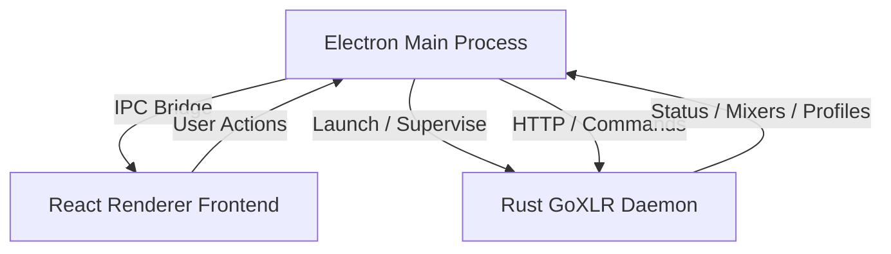

<p align="center">
  <strong>Omega GoXLR</strong><br/>
  Desktop-first control software for TC-Helicon GoXLR and GoXLR Mini
</p>

<p align="center">
  <a href="#english">English Documentation</a> • <a href="#deutsch">Deutsche Dokumentation</a> • <a href="CHANGELOG.md">Changelog</a>
</p>

<p align="center">
  
  
  
  
</p>

---

## Contents / Inhalt

| English | Deutsch |
| --- | --- |
| [English Documentation](#english) | [Deutsche Dokumentation](#deutsch) |
| [Core Features](#en-core-features) | [Hauptfunktionen](#de-hauptfunktionen) |
| [Tech Stack & Architecture](#en-tech-stack--architecture) | [Technologie & Architektur](#de-technologie--architektur) |
| [Installation & Development](#en-installation--development) | [Installation & Entwicklung](#de-installation--entwicklung) |
| [Roadmap](#en-roadmap) | [Roadmap](#de-roadmap) |
| [Changelog](CHANGELOG.md) | [Changelog](CHANGELOG.md) |

---

<a name="english"></a>
# EN English Documentation

**Omega GoXLR** is a desktop-first control center for the **TC-Helicon GoXLR** and **GoXLR Mini**.

The project combines a modern **Electron + React + TypeScript** desktop application with the proven **Rust-based GoXLR daemon architecture** from the open-source GoXLR utility ecosystem. The goal is to provide a polished, native-feeling control experience without re-inventing the risky hardware layer.

---

<a name="en-core-features"></a>
## Core Features

### 1. Desktop-First Experience
- A dedicated desktop app instead of a browser-first control flow.
- Local process management for the GoXLR backend daemon.
- Safe preload bridge between UI and system layer.

### 2. Multi-Device Readiness
- Detect and display multiple connected GoXLR devices.
- Switch between mixers from one desktop interface.
- Build toward device-specific profiles, scenes, and routing states.

### 3. Reusable Hardware Layer
- Uses the established GoXLR daemon model for hardware communication.
- Avoids re-implementing USB and low-level device logic in JavaScript.
- Keeps the door open for firmware, profiles, routing, and sampler support.

### 4. Future Desktop Workflow Focus
- Mixer dashboard
- Mic setup
- Routing matrix
- Profiles and presets
- Diagnostics and logs
- Stream Deck / OBS style workflow integrations

---

<a name="en-tech-stack--architecture"></a>
## Tech Stack & Architecture



- Frontend: React 18, TypeScript, Vite
- Desktop shell: Electron 30
- Packaging: electron-builder
- Hardware backend: Rust GoXLR daemon
- Release automation: GitHub Actions

---

<a name="en-installation--development"></a>
## Installation & Development

### Prerequisites
- Node.js 18 or newer
- npm
- For full local daemon integration: Rust toolchain or a built `goxlr-daemon.exe`

### Local Setup
1. Clone the repository:
   ```bash
   git clone https://github.com/OmegaProjct/Omega-GoXLR.git
   cd Omega-GoXLR
   ```
2. Install dependencies:
   ```bash
   npm install
   ```
3. Start development mode:
   ```bash
   npm run dev
   ```

### Build
```bash
npm run typecheck
npm run build
npm run dist
```

---

<a name="en-roadmap"></a>
## Roadmap

- Desktop prototype with daemon bridge
- Multi-device dashboard
- Volume and fader controls
- Routing matrix
- Mic setup
- Profile and preset management
- Sampler and lighting support
- Public release builds

---

<a name="deutsch"></a>
# DE Deutsche Dokumentation

**Omega GoXLR** ist eine desktop-orientierte Steuerzentrale fuer **TC-Helicon GoXLR** und **GoXLR Mini**.

Das Projekt kombiniert eine moderne **Electron + React + TypeScript** Desktop-App mit der bewaehrten **Rust-basierten GoXLR-Daemon-Architektur** aus dem Open-Source-GoXLR-Umfeld. Ziel ist eine saubere, native Bedienerfahrung, ohne die riskante Hardwarebasis neu zu erfinden.

---

<a name="de-hauptfunktionen"></a>
## Hauptfunktionen

### 1. Desktop-First Erfahrung
- Eine eigenstaendige Desktop-App statt eines browserlastigen Workflows.
- Lokales Prozessmanagement fuer den GoXLR-Backend-Daemon.
- Sichere Bridge zwischen Benutzeroberflaeche und Systemschicht.

### 2. Mehrgeraete-Bereitschaft
- Erkennung und Anzeige mehrerer angeschlossener GoXLR-Geraete.
- Wechsel zwischen Mixern in einer gemeinsamen Oberflaeche.
- Basis fuer profilspezifische Workflows, Szenen und Routing-Zustaende.

### 3. Wiederverwendbare Hardware-Schicht
- Nutzt das bestehende Daemon-Modell fuer die Hardware-Kommunikation.
- Vermeidet eine riskante Neuimplementierung der USB- und Low-Level-Logik in JavaScript.
- Haelt den Weg frei fuer Firmware-, Profil-, Routing- und Sampler-Support.

### 4. Fokus auf Desktop-Workflows
- Mixer-Dashboard
- Mikrofon-Setup
- Routing-Matrix
- Profile und Presets
- Diagnose und Logs
- Stream-Deck- / OBS-nahe Automationen

---

<a name="de-technologie--architektur"></a>
## Technologie & Architektur

- Frontend: React 18, TypeScript, Vite
- Desktop-Shell: Electron 30
- Packaging: electron-builder
- Hardware-Backend: Rust GoXLR Daemon
- Release-Automation: GitHub Actions

---

<a name="de-installation--entwicklung"></a>
## Installation & Entwicklung

### Voraussetzungen
- Node.js 18 oder neuer
- npm
- Fuer die volle lokale Daemon-Integration: Rust Toolchain oder ein gebautes `goxlr-daemon.exe`

### Lokales Setup
1. Repository klonen:
   ```bash
   git clone https://github.com/OmegaProjct/Omega-GoXLR.git
   cd Omega-GoXLR
   ```
2. Abhaengigkeiten installieren:
   ```bash
   npm install
   ```
3. Entwicklungsmodus starten:
   ```bash
   npm run dev
   ```

### Build
```bash
npm run typecheck
npm run build
npm run dist
```

---

<a name="de-roadmap"></a>
## Roadmap

- Desktop-Prototyp mit Daemon-Bridge
- Mehrgeraete-Dashboard
- Lautstaerke- und Fader-Steuerung
- Routing-Matrix
- Mikrofon-Setup
- Profil- und Preset-Verwaltung
- Sampler- und Lighting-Support
- Oeffentliche Release-Builds
